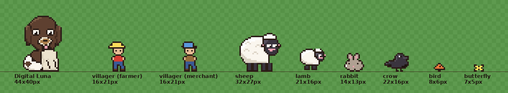

# Sheepcliff art direction

One page for what Sheepcliff looks like, so a new district or creature is drawn to it rather than to the
artist's guess. Distilled from `docs/STYLE_GUIDE.md`, the HANDOFF, and measurements off
`tools/art/pixel_grids.py`, `hand_sprites.py`, `farm_v3.py` and the built `spritesheet.json` — a number not
in the source is marked **proposed**. This is the owner's taste; nothing here overrides `CLAUDE.md`.

## Palette

The 15 entries in `PAL` (`pixel_grids.py`) are the character core. Pixel counts are from `palette_check.py`'s
scan of the built sheet, so "what it's for" is measured, not guessed — including `t`, which the table gives
as the value actually on the sheet, not the `pixel_grids.py` one: `hand_sprites.py:722` overwrites it before
any frame builds.

| char | rgb | pixels on sheet | used for |
|---|---|---|---|
| `k` | 43,29,23 | 17,532 | the one-pixel outline, on every character |
| `d` | 94,64,48 | 15,559 | DL coat base |
| `w`/`e` | 250,246,238 | 8,962 | sheep/lamb wool base; doubles as eye-white |
| `c` | 236,226,206 | 4,362 | DL cream chest, beard, paws |
| `f` | 58,52,62 | 3,745 | sheep/lamb/crow face and leg base |
| `s` | 220,212,198 | 1,993 | wool shadow (lower-left of the cloud) |
| `h` | 255,255,255 | 1,974 | wool highlight; DL's and the sheep's eye glint |
| `b` | 68,44,32 | 1,195 | DL coat "sel-out" — see Outline, below |
| `t` | 168,124,74 | 912 | DL tan muzzle (`hand_sprites.py:722` override) |
| `m` | 124,90,68 | 765 | DL coat highlight (crown, back) |
| `u` | 216,206,186 | 699 | DL cream shadow |
| `p` | 236,160,176 | 619 | pink: nose, inner ear, tongue |
| `n` | 28,18,14 | 461 | DL nose/pupil; the crow's pupil and belly shadow |
| `g` | 86,79,92 | 336 | face highlight; the crow's bill and back highlight |

The core isn't exclusive. `hand_sprites.py` also puts 15 single-purpose extras (icon/clothing/prop colours)
on the same sheet: `B`/`J` 372px, `H` 284, `S` 198, `F` 192, `y`/`Y` 167, `V` 132, `Z` 110, `Q` 100, `O` 72,
`v` 54, `X` 54, `R` 44, `q`/`G` 39, `z` 28, `L` 24.

Scenery is vector, not this palette — `farm_vectors.py` declares its own 29 module-level hex constants
(`GRASS_A/B`, `BARN_R` family, `FENCE`, …) for gradients and SVG fills. The one deliberate seam: vector `INK`
(`#2b1d17`) is exactly `PAL["k"]`, so scenery and character outlines read as the same ink, though nothing
else in the two palettes has to match.

## Outline

One pixel of `k`, added by `hand_sprites.outline()`: any transparent pixel touching a listed colour becomes
`k`. No double lines, no anti-aliasing, uniform on every character. Scenery's vector outline
(`stroke-width="3"` in the 1600-unit SVG space, `farm_vectors.STROKE`) renders to about 1.2px after the
0.4×-downsample — close to the character's 1px line but not identical; visually consistent, not the same
weight.

Where it breaks, on purpose or not:
- **Deliberate:** DL's running/bounding poses erase the outline at each ear's root (`dl_run`, `dl_trundle`:
  four pixels set to plain coat colour `d`, no `k`) so the ear reads fused to the skull, not stuck on.
- **A seam, not a break:** parts are hard-pasted (head over body, etc.), so an underlying part's outline is
  overwritten wherever a new part is opaque above it — clean when the silhouettes still meet, visible when
  they don't. See Weak spots below for the measured case.
- **Unshaded legs:** every character's legs are flat `f` (or `c`/`u` on DL) plus outline — no highlight/shadow
  split the way bodies get. Not a broken outline, but a real gap in shading effort.

## Light

Top-left, everywhere, but shown two different ways:
- **Sheep:** directional falloff inside the wool — `h` (highlight) clusters in the upper-left rows of the
  cloud, `s` (shadow) in the lower-left rows, `w` (base) fills the rest. Classic top-left key light.
- **Digital Luna:** `m` (highlight) sits on the crown and the back of the ears/coat; `b` isn't a lower-right
  shadow so much as a sel-out line run along the *whole* silhouette edge (both flanks) to separate her coat
  from whatever's behind it. She reads as lit from the top-left (see the crown), but her "shadow" colour does
  edge-definition more than falloff — looser than the sheep's rule.
- **Barn:** `barnFront`'s gradient runs light-at-top to dark-at-bottom (`#d84034` → `BARN_R`) on the front
  wall; the receding side wall is flat `BARN_RD`, darker than the front — the same top-left key expressed as
  front-vs-side.

## Scale per class

Two numbers per class: **canvas**, the fixed working grid its frames share (from `spritesheet.json`), and
**content**, the non-transparent bounding box of one standing/idle frame (method below). Canvas and content
differ because a canvas has to fit every pose a character strikes, not just the reference one.

| class | canvas (px) | content, reference frame (px) | status |
|---|---|---|---|
| Digital Luna | 44 × 40 | 27 × 39 sitting, 35 × 30 running | measured |
| sheep | 32 × 27 | 29 × 27 standing | measured |
| lamb | 21 × 16 | 18 × 16 walking, 18 × 15 mid-stride | measured |
| crow | 22 × 16 | 17 × 13 standing | measured — matches `CROW_BRIEF.md`'s own numbers exactly |
| villager (farmer/merchant) | 16 × 21 | 12 × 21 / 11 × 21 walking | measured, but **not owner-pinned as the "villager" class** — treat as a scale anchor, not settled canon |
| cat | ~20 × 14 | ~16 × 11 standing | **proposed** |

Method: `PIL.Image.getbbox()` on `to_img()` of the frame-builder (`sheep_frame()`, `dl_sit()`,
`LAMB_ANIMS["walk"][0][1]()`, `CROW_STAND`). Canvas is each sprite's `w`/`h` in `spritesheet.json`.

The **cat is proposed**, from the rules rather than a grid: smaller than a lamb, in the rabbit/crow size band
(rabbit 14×13, crow content 17×13), chibi head at ~40–45% of body height the way DL's and the sheep's heads
read first, one-pixel `k` outline, feet flat on the canvas floor. FARM_RULES' backlog ("more animals") and
CROW_BRIEF's precedent — measure, propose, wait for the pin — are the basis; no grid exists yet.

A **4x contact sheet of the existing cast at these scales** is at `tools/art/build/review/cast_contact_4x.png`
(below), built by a small one-off script (not committed) that only reads the committed `spritesheet.png`/
`.json` — no grid, palette, or sheet touched. Its checker background and label text are review chrome, not
palette: neither green matches `GRASS_A`/`GRASS_B`, and `palette_check.py` doesn't scan `build/review/`.

## Ground rule

Every animation touches the ground, once per animation. `render_v3.py:50` is
`bot = max(content_bottom(f) for f in frames)` — one floor from the animation's lowest frame, and every frame
in it crops to that floor. `CROW_BRIEF.md` puts it the same way: "every animation includes a frame that
touches row 15, so the sheet builder trims all of them to the same 16 rows." Bounce and flight frames float
above the floor by design: of 108 cast frames (sheep, DL, lamb, rabbit, bird, butterfly, crow, farmer,
merchant), 22 sit above their floor — `dl.trundle[0]`/`dl.bound[0]` 6px, `crow.fly[0]`/`crow.hop[0]`/
`crow.takeoff[1]` 3px, `dl.run[0]`/`[2]` and `dl.stick[0]`/`[2]` 2px, 13 more 1px, mid-stride or mid-air.
On the contact sheet every reference frame touches its floor except the lamb's mid-stride, one pixel up.

## Animation rules

Frames are variations of a grid — `paste`/`clear`/`shift`/`crop`/`flip_v`/`outline`, and `rot90` only for an
exact 90° turn — never a scale or arbitrary rotation of the rest pose. A walk cycle redraws the legs and
moves the body up a pixel; ears, tails and heads lag the body by a frame, where the charm lives (`dl_run`'s
three ear-flap heights trailing the bounce is the clearest case).

Frame count and fps by role, read off every `*_ANIMS` table:

| role | example | frames | fps |
|---|---|---|---|
| idle / status, many frames | DL `sit` | 8 | 4 |
| idle / status | sheep `graze`/`think`/`bleat` | 4 | 3 |
| walk/trot | sheep `trot`, lamb/farmer/merchant `walk` | 2–4 | 6 |
| fast locomotion | DL `run`/`stick`/`trundle`/`bound` | 4 | 9–12 |
| wingbeat | crow `fly`, butterfly `flap` | 2 | 6–8 |
| one-shot transition | crow `land`/`hop`/`takeoff`, sheep `cast` | 2 | 4–6 |
| slow ambient | DL `sleep`, sheep `rest` | 2–4 | 1–1.5 |

The rule underneath the numbers: idle/status states get more frames at a slow fps; locomotion gets few frames
at a high fps. DL `sit` (8) and `icon.all` (10) are the outliers — `STYLE_GUIDE.md`'s six-near-duplicate
warning is about frame *rate* (12fps), not count.

## New district backgrounds

`background()` builds an SVG at a 1600×1000 viewBox and `render_v3.py` rasterises it to a 640×400 PNG — a
0.4px-per-unit downsample. That 640×400 is also the game's own world canvas (`const W = 640, H = 400` in
`sim_template.html`): hand-pixel sprites draw onto it at native 1:1, then the whole thing scales ×2 for
display. A new district must go through the same viewBox → 640px pipeline so its ground and buildings sit at
the same pixel density as the cast standing on them.

- **Horizon / ground plane.** Field diamond corners on the 640×400 canvas: top (320, 44) — 11% down — right
  (624, 208), bottom (320, 372) — 93% down — left (16, 208). A new district's ground plane should meet this
  horizon unless the ticket deliberately changes it, so districts sit edge-to-edge.
- **Tile scale.** `grassP` repeats every 22×22 SVG units (skewed −30°, y-scaled ×0.6) → 8.8×8.8 render px per
  tile. A new ground texture should repeat at the same grain unless it's deliberately a different material.
- **Sky per phase**, from `render_v3.py`'s `PHASES` table and its `glow`/`sky` calls:

  | phase | tint (r,g,b mult) | window glow | sky depth outside the field | stars | moon |
  |---|---|---|---|---|---|
  | day | none | none | none | 0 | no |
  | dusk | 1.02, .78, .58 | ×0.6 | ~90–92% | 60 | no |
  | night | .40, .48, .80 | ×1.0 | ~45–53% | 260 | yes, crescent |
  | dawn | .96, .80, .86 | ×0.4 | ~95–96% | 40 | no |

  Each phase also has a snow variant (`snowify()`: greens desaturate toward white/blue). Sky/star/moon only
  apply *outside* the fenced diamond (`render_v3.py:103`: `ImageFilter.MaxFilter(9)` on the field mask — a
  9×9 kernel, 4px dilation) — a new district needs the same inside/outside mask so its dusk-to-night read
  matches the farm's.

## Weak spots (measured)

- **`sheep.graze`'s real notch is at the grass prop, not the neck.** Re-measured on the built frames:
  `graze[2]` (`head_dxy=(0,8)`) has zero transparent pixels with 3+ opaque neighbours — no neck gap. `graze[1]` has three, at (28,24)/(29,23)/(30,24) — the `GRASSBITE` extra
  pasted at (29,24), overlapping the mouth, not the neck seam.
- **Legs are the least-finished part of every character.** Flat single-tone fill plus outline, no
  highlight/shadow split, on sheep, lambs, DL and the crow alike — the shading budget goes to bodies and
  faces.
- **`farm_v3.py`'s vector-character builders are dead.** It still defines `sheep()`, `lamb()`,
  `digital_luna_sit/run/flop/sleep/stretch/nibble()`, `rabbit()`. Nothing reachable calls them (only dead
  siblings in the same file do): `ANIMS` builds every character from `hand_sprites.py`'s grids, and `render_v3.py` only touches
  `V.ANIMS`, `V.frame_svg`, `V.background`, `V.FIELD`, `V.GRASS_A/B` — the vector-rasterised-character
  approach the HANDOFF says was tried and rejected, left with nothing marking it dead.
- **`farm_vectors.py`'s builders aren't dead, just outside the v3 build.** `sheep()`, `lamb()`, `luna()`,
  `rabbit()` are called from `scene()` (`farm_vectors.py:258-266`) and listed in `ASSETS` (line 280 — there
  is no `SCENES` dict; that name is nowhere in the repo). Its `__main__` calls both and writes SVGs, so
  `python3 tools/art/farm_vectors.py` runs the lot, and `render.py:27` imports the module — a live v2
  comparison tool the v3 build never runs, worth flagging before anyone deletes it as dead weight.
- **DL's "shadow" colour isn't a shadow** in the sheep's sense — see Light, above. Pinned as-is, but copying
  her *b*-as-selout convention onto a new character won't automatically give correct top-left shading.
- **Villager and cat scale are both proposed, not pinned.** Farmer/merchant were never called out as "the
  villager class"; treat the numbers above as a pin-review start, not settled fact.
- **The crow's own admitted weak frames** (`CROW_BRIEF.md`): head-down peck hides the far leg behind the
  head; `hop` reads close to a shifted `stand` at 1x. Carried over, not re-litigated.
