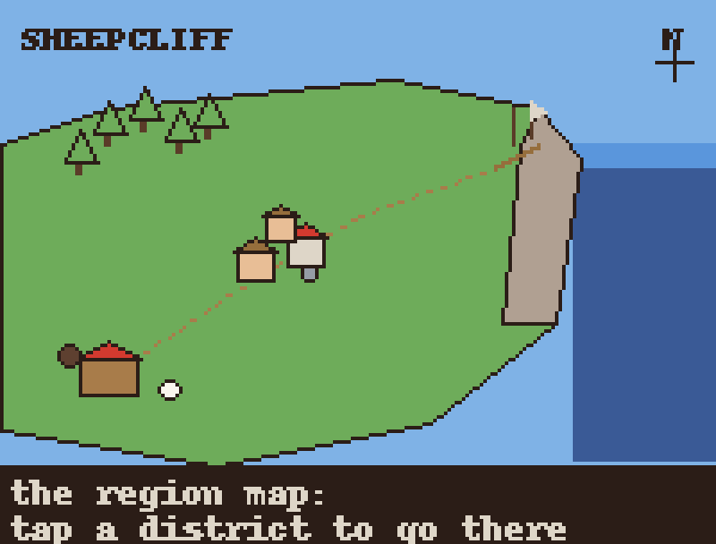
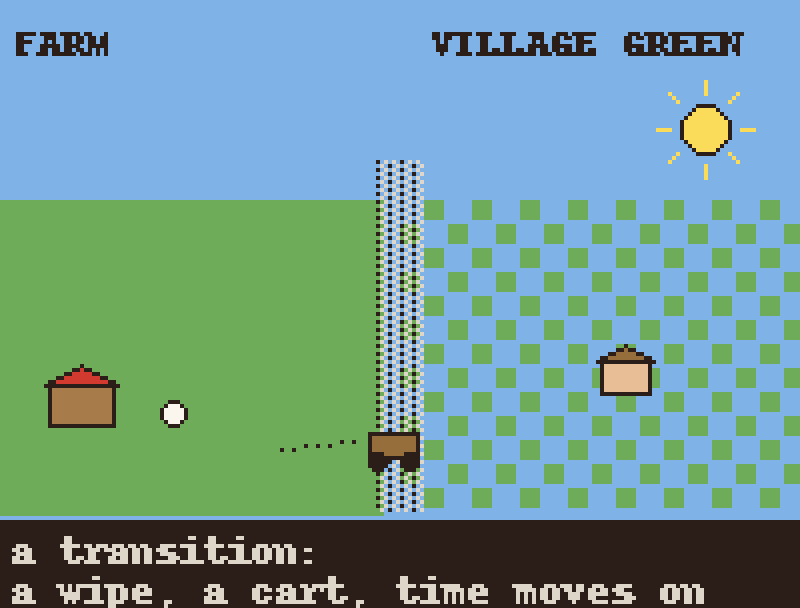
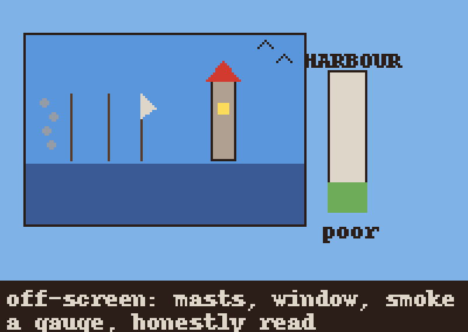

# Region map — how districts connect

For the owner's pin. Issue #62: design moving between districts as a system before Village Green is built,
so it isn't built assuming there are only two places.

The three images below are **sketches, not sprites** — plain shapes at 1x snapped to the palette in
`pixel_grids.py` / `hand_sprites.py`, scaled 4x by `make_region_sketches.py`. No hand-pixelled grid, no new
colour, no claim to final art.

## 1. The map, as the player sees it



One hand-drawn region, not a grid of tiles: a cliff-top landmass shaped as the plan describes (section 3)
— the farm in the lee of the cliff, a lane climbing to the village green, the cliff edge over the harbour,
the wildwood behind. It opens from the tray's map button (plan section 4, "one tray, one map"). Each
district is a tappable hotspot, drawn as a small landmark (the barn, cottage roofs, a mast) rather than a
labelled pin, so the map reads as a place before a menu. Tapping a district that isn't current starts a
transition; tapping the current one closes the map. A small mark (Digital Luna) shows where the player
stands.

The map is a fixed background plus the same hotspots, cheap to render and safe to leave open while the
world keeps ticking underneath — opening it never pauses the sim.

## 2. The district model

A district is three things, and only three:

- **A scene.** The same 640×400 world-pixel space the farm already is (`FARM_RULES.md:4`), with its own
  background set (four clock phases, two weathers, the farm's pattern), camera, and layer stack.
- **A Ledger.** The district's numbers — stocks, clock, weather, season — the shape `packages/sim/src/
  ledger/` already gives the farm (`Ledger`, `summarise` in `ledger.ts`; `advanceLedger`, `respawn`,
  `diffLedger` in their own files, exported from `ledger/index.ts:4-8`). Every district gets one, but not
  the same one: a settlement's Ledger carries fields the farm's has none of (§7 is explicit about this).
- **A cast.** The inhabitants who belong there — traits, homes, jobs, social-graph edges — summarised
  into the Ledger off screen and respawned on entry (plan section 2, layer 2).

A district is not a level, a room, or a save slot. It is addressable state (its Ledger) plus a place to
render it (its scene) plus who lives there (its cast); the map decides which scene is drawn and which
Ledgers keep ticking regardless.

## 3. Travel

Three things travel between districts, at three resolutions:

| What moves | Carries | Sim-time cost | Visible as |
|---|---|---|---|
| **Goods** (wool, bread, fish, honey) | one stock into another | a per-link lag (farm→village same-day, village↔harbour ~half day, wildwood ~a day), inside `advanceLedger` | a cart/boat glyph on the lane/water, a stock tick at the gauge |
| **Caravans** (the merchant, a fisher's catch run) | an NPC visit, the farm's `merchantAtMs` shape | one `merchantAtMs`-style timer per link | the NPC leaving one edge, arriving at the next on schedule |
| **DL herself** | the player's point of view | a short, fixed transition (§4), not simulated sim-time | the transition; she reappears near the lane's end |

Goods and caravans travel whether the player watches or not — Ledger-resolution, the policy letting a week
away build a barn. DL travelling is "loading a different scene," a UI beat, not a sim event.

**From the map**, a glyph advances along the lane at a rate matching its timer, so a glance shows if a
delivery is close or setting out. **From either end**, the sender's scene shows it leaving, the receiver's
shows it arriving, and a chronicle line records it. Never invisible, only not always on screen.

## 4. A transition



Tapping a district hotspot does not cut. It plays a short (under one second) pixel-dissolve wipe in the
palette's own dither style — the sketch shows the seam as a stippled band. A proposal, not precedent: the
farm has no snow overlay to point to. Snow there swaps to pre-snowified backgrounds (`snowify`,
`render_v3.py:73-91`), a lerp toward white with dithering explicitly off (`quantize(..., dither=Image.
NONE)`) — the opposite of a stipple. A stipple is a dissolve style the art hasn't used yet, so it earns its
own owner pin, not a ride on an existing pattern. A cart or footprint trail sells the idea this is a place
walked to, not a menu opened. Because DL's crossing costs no sim-time, the wipe is a camera cut with a
costume on; underneath it, the outgoing district's actors are summarised into its Ledger (plan section 2:
"the player never sees the seam") and the incoming district respawns from its own.

## 5. Off-screen districts, and how a gauge reads from the map



A district you are not standing in is never fully invisible: an adjacent scene or the map gives a small,
cheap peek — a smoke plume over the ridge, a lit window at dusk, masts over the cliff line. Two or three
sprites keyed off the neighbouring district's Ledger (a lit window only at dusk with someone home; smoke
only if hearth stock is above zero) — cheap because they read a number, not because they run actors.

A **gauge** abstracts the same idea further: a small bar on the map reading one or two Ledger numbers
straight, no interpretation layered on. The harbour gauge (plan section 3: "a gauge of the settlement
economy and a set piece," not the only gauge) reads the trade stock directly, saying "poor" when low — plan
section 3 is explicit it "reads poor honestly until the economy earns better." The sketch shows a bar
mostly empty. Every district gets a gauge once it has a Ledger: a village gauge could read granary, a
wildwood honey. Gauge and peek-view share a Ledger read; neither needs the scene loaded.

## 6. Saves, catch-up, and the chronicle per district

Proposal: each district's Ledger gets its own save entry (versioned, same migration harness as the farm's
— not free, see §9). `catchUp(state, awayMs, options)` (`catch-up.ts:55`) advances a `SimState` by `awayMs`
of **sim** time, mapped from wall-clock time by the host, not a `Ledger`: a district existing purely as its
Ledger between visits has no `SimState` to hand it. Catch-up per district needs one of two things this doc
doesn't yet design: a cheap respawn shell per off-screen district, or a `Ledger`-only catch-up path —
sim-lane work, not a rename.

Cost is not flat either. Under one sim-day `catchUp` takes the actor path outright (`step(state, [], gap)`,
`catch-up.ts:65`) — a short gap is N full actor simulations, not N cheap reads. Only a day or more takes
the cheap Ledger path (`advanceLedger`, `respawn`, `step` for the remainder — `catch-up.ts:71-74`). A week
away costs about what one farm catch-up costs today, run once per district; a ten-minute gap does not.

The chronicle doesn't exist in code yet (plan line 50: "the next things built"). Its design already gives
each entry a district field (plan line 80), so a "while you were gone" page pulling entries across every
district in order is the right shape to build toward — a proposal, not something already working.

## 7. What the Village Green ticket must not assume

- That there are only two districts. The map, the Ledger-per-district shape, and the travel model are sized
  for four (plan section 3) from the start; Village Green is the second entry, not a special case.
- That the farm's Ledger shape (flock, wool, coins, grass) is the settlement's. A settlement has stocks the
  farm does not (granary, market, a mood `moodOf` doesn't cover) and a growth table the farm has none of
  (plan section 2: the farm's builds are the owner's; a settlement's surplus rule runs inside
  `advanceLedger`).
- That travel is instant or free. Every good crossing a district edge has a lag and a visible carrier — no
  goods from the farm with no cart and no delay.
- That an off-screen district goes dark. It still ticks its Ledger and may be glimpsed (§5); Village Green
  needs a legible gauge and, once the harbour exists, a legible peek across the cliff.
- That the map is a menu. It is a place with hotspots, drawn in the pixel style, not a list of buttons;
  Village Green's hotspot needs a landmark glyph, not only a label.
- That "growth" means a shop. Plan section 2 is explicit: unlocks arrive from a settlement's own stocks
  over time, nobody shops.

## 8. The settlement data shape the sim lane will need

Extending the farm's `Ledger` (`ledger.ts`), not replacing it:

```ts
interface SettlementLedger {
  seed: number;
  clock: Clock;           // shared world clock, as today
  season: Season;
  weather: Weather;
  stocks: Record<string, number>;   // e.g. { grain: 12, bread: 3, mood: 0.6 }
  cast: SettlementCastMember[];     // id, role, home, traits, for `respawn`
  edges: SocialEdge[];              // bond/family/rivalry, like the flock's
  growth: {
    table: GrowthRule[];            // { stock, threshold, sustainedForMs, unlocks: BuildId[] }
    built: BuildId[];               // what already resolved, so a rule fires once
  };
  gauge: Record<string, number>;    // 0..1 readings the map draws directly (e.g. { trade: 0.15 })
  edgesToOtherDistricts: TravelLink[]; // { to: DistrictId, kind: 'cart' | 'caravan', etaMs, cargo }
}
```

`GrowthRule` and `TravelLink` are new; the rest is the farm's own fields renamed and generalised
(`wool`/`grass` become `stocks`, flock/lambs become `cast`). The map reads only `gauge`, so a gauge UI
change never touches settlement logic. `edgesToOtherDistricts` is what cart/caravan glyphs animate against,
letting village and harbour Ledgers reference each other without either owning the link.

## 9. Weak spots, named honestly

- **The transition wipe is a guess.** Never seen moving; a static sketch can't prove it reads as a place,
  not a loading screen. First build needs a fast owner pin before content assumes it's right.
- **Travel timing numbers are placeholders.** "Same-day," "half a day" are round numbers, not playtested;
  the economy lane should tune them once the village exists.
- **The peek-view is unbuilt and unbudgeted.** Cheap in theory — a couple of sprites keyed to a neighbour's
  Ledger — but never measured against the render lane's frame budget with more than one peek in a scene.
- **Only the farm exists in code.** Every idea here is designed against a settlement Ledger shape not yet
  ported or parity-tested.
- **The map's hotspots are untested for touch.** A small barn icon may be too small to tap reliably on a
  phone; needs an interaction pass, not just an art pass.
- **DL's zero-sim-time crossing leaves a question open:** does a sheep she rides cross instantly with her,
  or is that disallowed. Left for the settlement-actions design.
- **The save is single-world today.** `SaveWorld = Omit<SimState, 'version'>` (`save/doc.ts:21`) stores one
  world, not districts; a save entry per district (§6) needs a `SAVE_VERSION` bump and migration — sim-lane
  scope, not a formality.
- **District clock coherence is undefined.** §8's `clock: Clock; // shared world clock, as today` describes
  nothing real: `Ledger.clock` is per-ledger (`ledger.ts:27`) and `catchUp` advances each state's clock
  independently (`catch-up.ts:71-75`) — districts caught up separately can drift. Who owns the world clock
  is unanswered.
- **Chronicle volume across districts is untested.** One log for four districts multiplies "while you were
  gone" entries by district count; notability (plan line 82) has never run at that volume, and "that
  world's own normal" is ambiguous once more than one world's numbers are in play.
- **Deity powers across districts are unaddressed.** Plan line 91 makes intents the only outside input, but
  never says if a power can target an off-screen district, or if weather is regional or per-district —
  Village Green will hit this immediately.
